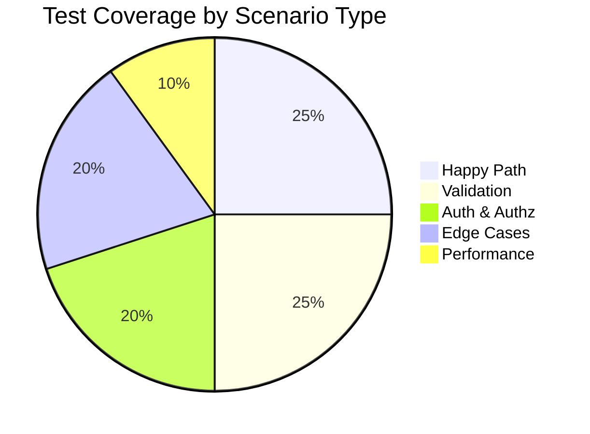

# 🧪 TEST SUMMARY — {{FEATURE_NAME}}

> **📅 Date:** {{YYYY-MM-DD}} | **⏱ Duration:** {{minutes}} min | **👤 Tester:** {{name}}

---

## 🔍 Overview

| Metric | Value |
|--------|-------|
| **Feature** | `{{feature_name}}` |
| **Mode** | 🅰️ API / 🔗 Flow / 🗄️ DB / ⚡ Performance / 🧹 Code Quality |
| **Endpoint(s)** | `{{method}} {{path}}` |
| **Tests Generated** | {{count}} |
| **Passed** | ✅ {{passed}} |
| **Failed** | ❌ {{failed}} |
| **Coverage** | 🟢 {{coverage_pct}}% |

---

## 📋 Endpoint Summary

```
{{method}} {{path}}
```

| Section | Details |
|---------|---------|
| **🔗 Params** | `{{param_list}}` |
| **📮 Headers** | `{{header_list}}` |
| **🔒 Auth** | `{{auth_type}}` — Roles: {{roles}} |
| **✅ Validations** | {{validation_count}} rules checked |
| **📦 Response** | `{{status_code}}` → `{{response_shape}}` |
| **🛡️ Security** | SQLi ✅ | XSS ✅ | CSRF ✅ | Rate Limit ✅ |
| **🗄️ DB Tables** | {{tables}} |
| **📊 Queries** | {{query_count}} per request — N+1: {{nplus_one}} |
| **⚡ Performance** | p95: {{p95}}ms | Max: {{max}}ms | Payload: {{payload_kb}}KB |
| **🧹 Clean Code** | {{clean_code_verdict}} |

---

## ✅ Test Scenarios

| # | Scenario | Status | Notes |
|---|----------|--------|-------|
| 1 | Happy Path — {{action}} | ✅ Pass | |
| 2 | Validation — empty payload | ✅ Pass | |
| 3 | Validation — missing required field | ✅ Pass | |
| 4 | Validation — invalid data type | ✅ Pass | |
| 5 | Auth — no token (401) | ✅ Pass | |
| 6 | Auth — invalid token (401) | ✅ Pass | |
| 7 | Auth — wrong role (403) | ✅ Pass | |
| 8 | Not Found — nonexistent ID (404) | ✅ Pass | |
| 9 | Edge — empty collection | ✅ Pass | |
| 10 | Edge — pagination | ✅ Pass | |
| 11 | Edge — max length inputs | ✅ Pass | |
| 12 | Idempotency — duplicate (409) | ✅ Pass | |

---

## 🐛 Issues Found

| Severity | Issue | File | Status |
|----------|-------|------|--------|
| 🔴 High | — | — | — |
| 🟡 Medium | — | — | — |
| 🔵 Low | — | — | — |

---

## ⚡ Performance Results

```
Response Time:
  p50:  120ms  ████████████░░░░░░  ✅ < 150ms
  p95:  280ms  ██████████████████░░  ✅ < 300ms
  p99:  450ms  ████████████████████  ✅ < 500ms

Payload Size: 12KB  ████░░░░░░░░░░░░  ✅ < 100KB
Query Count:  2     ██░░░░░░░░░░░░░░  ✅ ≤ 3
```

---

## 🗄️ Database Query Analysis

| Query | Count | Index Used | Optimized |
|-------|-------|------------|-----------|
| SELECT users | 1 | ✅ PRIMARY | ✅ |
| SELECT profiles (eager) | 1 | ✅ user_id | ✅ |
| **Total** | **2** | — | — |

> ✅ No N+1 detected. All queries indexed.

---

## 🧹 Clean Code Assessment

| Metric | Status |
|--------|--------|
| Single Responsibility | ✅ SRP maintained |
| Naming Conventions | ✅ PascalCase / camelCase |
| Method Length | ✅ < 30 lines |
| Validation Separate | ✅ FormRequest used |
| Resource Transformer | ✅ API Resource used |
| Logging | ✅ Included |

---

## 💡 Optimization Suggestions

- [ ] Add composite index on `(status, created_at)` for list queries
- [ ] Cache role listing — rarely changes, 5min TTL
- [ ] Consider cursor pagination for large datasets

---

## 📁 Test Files

| File | Lines | Action |
|------|-------|--------|
| `tests/Feature/Api/V1/{{Resource}}Test.php` | {{lines}} | 🔧 New |
| `templates/testing/{{feature}}.md` | {{lines}} | 🔧 New |

---

## 📊 Coverage Summary



---

## 📝 Notes

```
{{free_text_notes}}
```

---

<div align="center">
  <sub>
    🧪 Test Summary — {{YYYY-MM-DD}} — {{feature_name}}
    <br>
    ✅ {{passed}}/{{total}} tests passing | 🟢 {{coverage_pct}}% coverage
  </sub>
</div>
